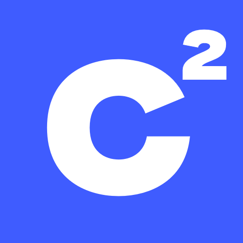

<center></center>

# C² Language
A simple and efficient programming language designed for modern software development.

## Overview

C² is a compiled language that combines the performance of low-level languages with the simplicity and readability of high-level languages.

## Features

- Static typing with type inference
- Memory safe compilation
- Fast execution
- Simple syntax
- Cross-platform support

## Getting Started

### Installation

Download the latest version from the official repository and follow the platform-specific installation guide.

## Basic Syntax

### Variables and Types

```c
int count = 10
float pi = 3.14159
bool active = true
```

### Functions

```c
func add(int a, int b) -> int {
    return a + b
}
```

### Control Flow

```c
if (count > 5) {
    // Greater than
} else {
    // Less or Equal than 
}
```

<!--
## Documentation
- [Documentation](https://github.com/C2-Lang/csq-docs).
- [Specification](https://github.com/C2-Lang/csq-spec).
-->
