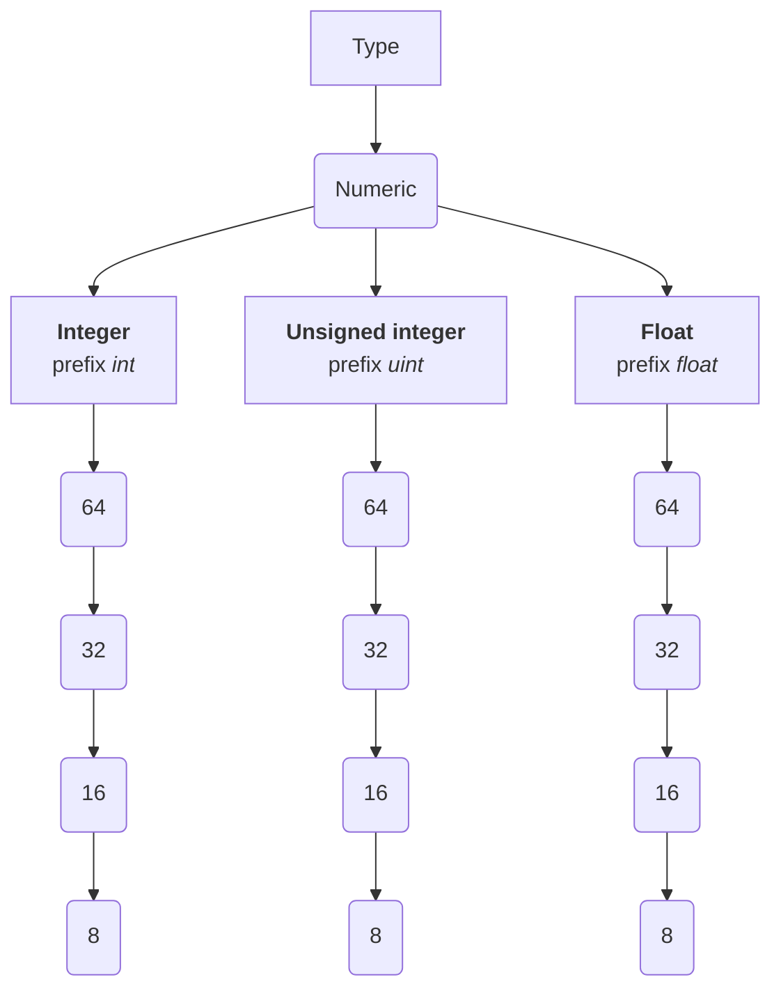

# Ideas
This file serves as a way to store all things I have planned (changes/additions) for Raven, but are not formally stated in the specification or implemented in the source code.

## Casting
Casting is a feature which, for some reason, I didn't add in the first place (probably because I forgot about it).

Casting is essential in statically-typed languages, as sometimes you want to add two values with similar but technically different types and can't, so you cast.

### Syntax
Casts in Raven will most-likely use this syntax:
```
V.(T)
```
An example:
```
let x: int16 = 5;
let y: int64 = x.(int64) // int == int32
```

### You can't *downcast*.
Downcasting consists in casting a value to another lower in the hierarchy.

Following this graph:

> Square = group, Rounded = assignable type

We can't cast an `int64` to an `int32`, even the value is assignable to a `int32` (=it doesn't overflow), it's still illegal.

## Maybe values
Raven lacks a `null` type **right now**, which was a design decission at first, yes, and then I quickly noticed that absence of value is sometimes needed.

I first made Raven not include an "absence of value" type because I though that it would prevent issues like usage of a variable with no value, but the best solution is not removing it, but **forcing** the user to do necessary checks.

Maybe values are the replacement of a simple `null` type.

A maybe value is defined with the keyword `maybe`:
```
let x: maybe int = 5;
let y: maybe int = null;
```

> `null` is a singleton value that has no standalone type and is only valid as a value of `maybe T`.

Rules:
- `T` **can't** have a `maybe T` as its value.
- `maybe T` **can** have either `T` or `null` as its value, but not another `maybe T`.
- A maybe value **can't** be used without *unwrapping*.
- Maybe types **can't** be casted.

### Unwrapping maybe values
To unwrap a `maybe` value, the `?` operator shall be used along an if-statement (or any block that checks for a condition, such a `while` loop).

When we unwrap, for the duration of the block `x` (a `maybe T`) will turn into a `T`, only in that scope and only until the block ends.

*Example*:
```
let x: maybe int = 6;
if (x?) {
    print(x); // Here `x` is an integer because we unwrapped.
} else { // In case `x` was actually `null`
    print("x doesn't have a value!");
}
```

You can use the `and` operator to unwrap various values if each one has a value, but you can't use the `or` to unwrap either one or another.
```
let x: maybe int = 6;
let y: maybe int = 51;
if (x? and y?) {
    print("${x}, ${y}");
} else {
    print("x or y doesn't have a value!");
}
```

You **can't** negate the `?` guard, and also can't use it outside conditional or loop.

## Unique denominator for built-in functions
Use a prefix (such as `&`, `!`, or `@` + change the tag prefix) to call built-in functions and make them differ from user-defined ones.

This feature is inspired by [Zig](https://ziglang.org/).

## Better memory management
Raven, even if promised to be general-purpose, lacks the ability to manage memory, even minimally.

That's why I propose the addition of **references**.

References, defined using the `*` symbol **before** the typename/identifier, allow one to use a reference to the variable's address instead of a copy.

This allows for more complexity and adds functionallity that wasn't possible before:
```
function increment(target: *int): void {
  target++; // Use of reference: the variable will increment globally.
}

function main(): int {
  let x = 5;
  increment(*x);
  print(x); // Output: 6

  return 0;
}
```

## Module-based structure
Right now, in Raven specification, there is no mention of importing/including other files.

So, I propose a module system for Raven:
- Each file is a *module*.
- Each directory represents a *namespace* and **CAN** contain a *main module* under the name `init.rvn`, which will be imported using the namespace's name.  
- Each module can **import** other modules from different namespaces, although two modules can't import each other.

## Change to concurrency
Instead of the simple task-based concurrency model, 
I propose completely removing **BUILT-IN** concurrency in Raven and moving it to a external mode (like in Rust).

## Metaproperties
Meta properties (which, depending on the final idea, might be renamed to *Special properties*), are properties which redefine behavior: operator overload functions (to allow addition of structures), properties to control how the compiler treats certain values, etc.

Meta properties are defined using the `meta` keyword, which works exactly as the `private` keyword (and can go alongside):
```
struct Apple(seeds: int = 5) {
  seeds: int;

  meta function add(self, apple2: Apple): int {
    return self.seeds + apple2.seeds;
  };
}

function main(): int {
  let apple = new Apple;
  let apple2 = new Apple(6);
  print(apple + apple2);

  return 0;
}
```
> Above is an example of a structure with the `+` operator overload, defined as *add*.

## Features depending on [metaproperties](ideas#Metaproperties)

### Frozen values
Changing the `frozen` metaproperty to `true` by using a built-in function allows the user to make a variable constant until it is unfrozen.

An example of this:
```
function main(): int {
  let age: int = 13; // Age is mutable.
  freeze(age); // Age turns immutable.

  // Code...

  unfreeze(age); // Age turns mutable.
  age++; // Allowed: age is no longer frozen.
  return 0; 
}
```
